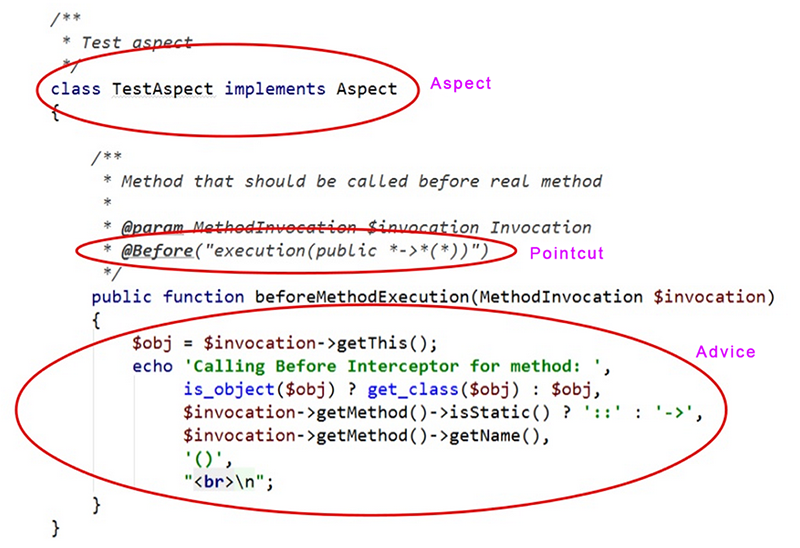

Aspects
#######

    In computing, aspect-oriented programming (AOP) is a programming paradigm which
    isolates secondary or supporting functions from the main program's business
    logic. It aims to increase modularity by allowing the separation of cross-
    cutting concerns, forming a basis for aspect-oriented software development.

    -- Wikipedia

The concept of Aspect-Oriented Programming (AOP) is fairly new to PHP. There's
currently no official AOP support in PHP, but there are some extensions and
libraries which implement this feature. In QuickAppsCMS AOP is implemented using the
`Go! PHP <http://go.aopphp.com/>`__ library, most of the following documentation
comes from theirs, so please consider visiting `GO! documentation
<http://go.aopphp.com/docs/introduction/>`__ for more details.

The Basic Vocabulary
====================

At the heart of AOP is the **aspect**, but before we can define "aspect," we must
discuss two other terms: **point-cut** and **advise**. A point-cut represents a
moment in your source code, specifying the right moment to run our code. The code
that executes at a point-cut is called, advise, and the combination of one or more
point-cuts and advises is the **aspect**.

Typically, each class has one core behavior or concern, but in many situations, a
class may exhibit secondary behavior. For example, a class may need to call a logger
or notify an observer. Because these functionalities are secondary, their behavior
is mostly the same for all the classes that exhibit them. This scenario is called a
cross-concern; these can be avoided by using AOP.

Glossary
--------

- Aspect: A modularization of a concern that cuts across multiple objects. Logging,
  caching, transaction management are good examples of a crosscutting concern in PHP
  applications. Go! AOP defines aspects as regular classes implemented empty Aspect
  interface and annotated with the @Aspect annotation.

- Join point: A point during the execution of a script, such as the execution of a
  method or property access.

- Advice: Action taken by an aspect at a particular join point. There are different
  types of advice: @Around, @Before and @After advice.

- Pointcut: A regular expression that matches join points. Advice is associated with
  a pointcut expression and runs at any join point matched by the pointcut (for
  example, the execution of a method with a certain name).

Types of advice
---------------

- Before advice: Advice that executes before a join point, but which does not have
  the ability to prevent execution flow proceeding to the join point (unless it
  throws an exception).

- After returning advice: Advice to be executed after a join point completes
  normally: for example, if a method returns without throwing an exception.

- After throwing advice: Advice to be executed if a method exits by throwing an
  exception.

- After (finally) advice: Advice to be executed regardless of the means by which a
  join point exits (normal or exceptional return).

- Around advice: Advice that surrounds a join point such as a method invocation.
  This is the most powerful kind of advice. Around advice can perform custom
  behavior before and after the method invocation. It is also responsible for
  choosing whether to proceed to the join point or to shortcut the advised method
  execution by returning its own return value or throwing an exception.

Creating Aspects
================

Aspect is the key element of AOP philosophym, and AOP API just uses simple PHP
classes for declaring aspects.

All Aspects classes must extends from ``QuickApps\Aspect\Aspect``, and like almost
everything in QuickAppsCMS, Aspect classes cannot exists by their own, instead they
must be created as part of some plugin.

Plugins can create any number of such classes by placing them into the
**<PluginName>/Aspect/** directory of your plugin, QuickAppsCMS will automatically
loads and registers these classes for you at bootstrap process.

In the following example we'll intercept all the methods related to User
login/logout cycle, to do this we'll focus on the
``User\Controller\GatewayController`` class which is responsible of handling user's
login, logout, registration and so on:

.. code:: php

    // MyPluginIntercetorDemo/Aspect/UserAspect.php

    namespace MyPluginIntercetorDemo\Aspect;

    use Go\Aop\Intercept\MethodInvocation;
    use Go\Lang\Annotation\After;
    use Go\Lang\Annotation\Around;
    use QuickApps\Aspect\Aspect;

    /**
     * User aspect
     */
    class UserAspect extends Aspect
    {

        /**
         * This method will be called BEFORE "GatewayController::logout()".
         *
         * @param MethodInvocation $invocation Invocation
         * @Before("execution(public User\Controller\GatewayController->logout(*))")
         */
        public function beforeLogin(MethodInvocation $invocation)
        {
            $controller = $invocation->getThis();
            $request = $controller->request;

            // some logic here
        }

        /**
         * This method will be called BEFORE "GatewayController::login()".
         *
         * @param MethodInvocation $invocation Invocation
         * @Around("execution(public User\Controller\GatewayController->login(*))")
         */
        public function beforeLogin(MethodInvocation $invocation)
        {
            // Returning null or false will stop "GatewayController::login()"
            // invocation. The following line indicates that it should proceed
            // normally.
            return $invocation->proceed();
        }

        /**
         * This method will be called AFTER "GatewayController::logout()".
         *
         * @param MethodInvocation $invocation Invocation
         * @After("execution(public User\Controller\GatewayController->logout(*))")
         */
        public function afterLogin(MethodInvocation $invocation)
        {
            // some logic here
        }
    }

Altering Objects
----------------

Usually you would need to alter properties of the object being intercepted in order
to change its behavior. You can get and set any property using the methods
``getProperty()`` and ``setProperty()`` respectively, this methods can get and set
properties even if they are protected or private:

.. php:function:: QuickApps\Aspect\Aspect::getProperty(object $object, string $property)

    Get property value from the given object, regardless its visibility.

.. php:function:: QuickApps\Aspect\Aspect::setProperty(object $object, string $property, mixed $value)

    Sets property value of the given object, regardless its visibility.

In this example we'll intercept a method invocation and alter its arguments:

.. code:: php

    /**
     * This method will be called BEFORE "GatewayController::login()".
     *
     * @param MethodInvocation $invocation Invocation
     * @Around("execution(public QuickApps\View\Helper\HtmlHelper->link(*))")
     */
    public function beforeLogin(MethodInvocation $invocation)
    {
        list($title, $url, $options) = $invocation->getArguments();
        $title .= ' [altered]';
        $this->setProperty($invocation, 'arguments', [$title, $url, $options]);
        return $invocation->proceed();
    }
