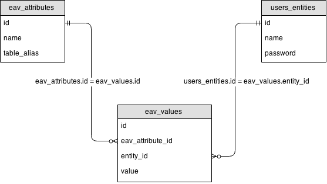

EAV API
#######

    Entity–attribute–value model (EAV) is a data model to describe entities where
    the number of attributes (properties, parameters) that can be used to describe
    them is potentially vast, but the number that will actually apply to a given
    entity is relatively modest. In mathematics, this model is known as a sparse
    matrix. EAV is also known as object–attribute–value model, vertical database
    model and open schema.

    -- Wikipedia

----

You will typically use an EAV pattern when you have Entities with a variable number
of attributes, and these attributes can be of different types. This makes it
impossible to define these attributes as column in the entity's table, because there
would be too many, most of them will not have data, and you can't deal with dynamic
attributes at all because columns need to be pre-defined in relational databases.

To solve this situation in a relational fashion you would create a child table, and
relate that to the 'entity' table using a One-to-Many relation, where every
attribute would become a record in the child table ("eav_attributes" in the image).
Downside of this approach however is that to be able to get a specific attribute
value, you'll have to loop over all related records, compare the value of the
attribute column with the attribute you look for, and if a match is found, get the
contents of the value column.

QuickAppsCMS's EAV API uses this same implementation, but allows you to merge these
virtual attributes with the entity, so the attributes become properties of the
entity object.

Table Of Contents
=================

.. toctree::
    :maxdepth: 1

    eav-api/usage
    eav-api/defining-attributes
    eav-api/dropping-virtual-columns
    eav-api/fetching-entities
    eav-api/bundles
    eav-api/cache

.. meta::
    :title lang=en: Field API
    :keywords lang=en: api,fields,field,behavior,eav,entity
