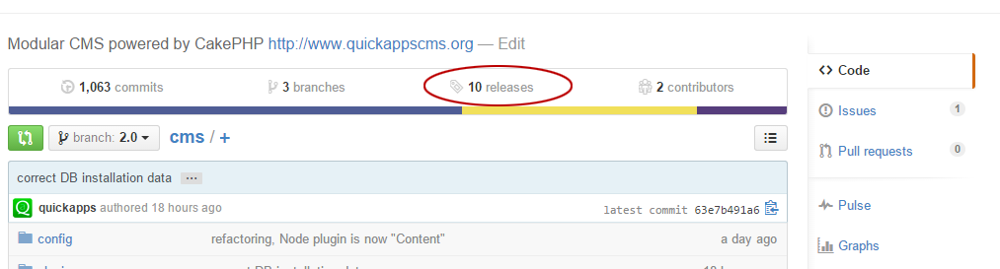
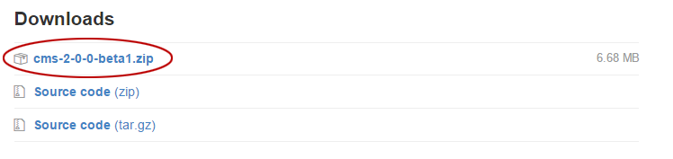
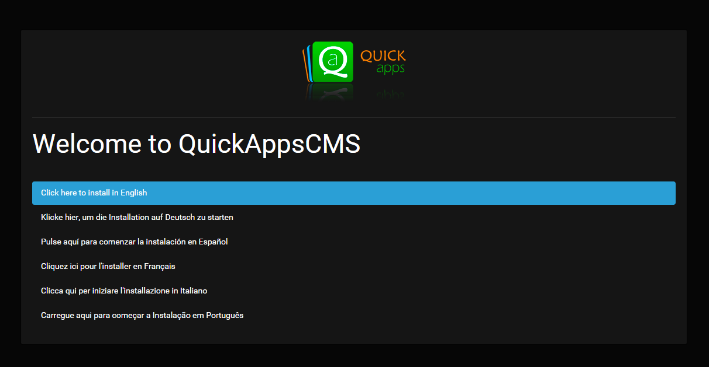

Installing QuickAppsCMS
#######################

Here we'll explain various installation methods for getting QuickAppsCMS up and
running. There are basically two ways to install QuickAppsCMS, using either a CLI
(command line interface) or an `FTP client
<https://en.wikipedia.org/wiki/File_Transfer_Protocol>`__ to upload the installation
files to your server. Before continue please double check that your server meets the
requirements described in the :doc:`Requirements <requirements>` section.

Install using FTP
=================

Go to QuickAppsCMS official repository hosted at GitHub, and then visit the
`releases section <https://github.com/quickapps/cms/releases>`__:

Find the latest stable release and download the zip package attached to the release
announcement, you will find these packages at the end of each announcement:

Extract the .ZIP file and upload to your server hosting using the FTP client of your
choice. After you’ve done this, be sure to chmod the following directories (with
containing files) to 777, so they are readable and writable by QuickAppsCMS:

- ``config/``
- ``log/``
- ``plugins/``
- ``tmp/``
- ``vendor/``
- ``webroot/``

.. warning::

    Linux users, remember to upload the **.htaccess** file as well (dot files are
    considered hidden in Linux), otherwise QuickAppsCMS will not work property
    without it.

Once everything is uploaded to your server and all permissions has been properly set
to 777, you must now visit your domain URL using the browser of your choice:

    http://www.example.com

You should follow the installation instructions provided by the installation
interface:

Install using Composer
======================

Installing QuickAppsCMS using `composer <http://getcomposer.org>`__ is fast and
easy:

Download `Composer <http://getcomposer.org/doc/00-intro.md>`__, or update using the
following command:

    ``composer self-update``

Then start the installation using the command below:

    ``php composer.phar create-project quickapps/website <PROJECT> --prefer-dist``

If Composer is installed globally, run:

    ``composer create-project quickapps/website <PROJECT> --prefer-dist``

Change <PROJECT> to the name of your project before running the command. After
composer is done visit your domain URL to start QuickAppsCMS’s web installer
interface and follow the instructions as described the previous section.

Getting Help
============

If you're stuck, there are a number of places you can :doc:`get help </getting-
started/help>`.

.. meta::
    :title lang=en: Installation
    :keywords lang=en: install,requirements,apache,php,version,database,db,quickapps,composer,mbstring,safe mode,safe_mode,mod_rewrite,mysql,postgre,sql
